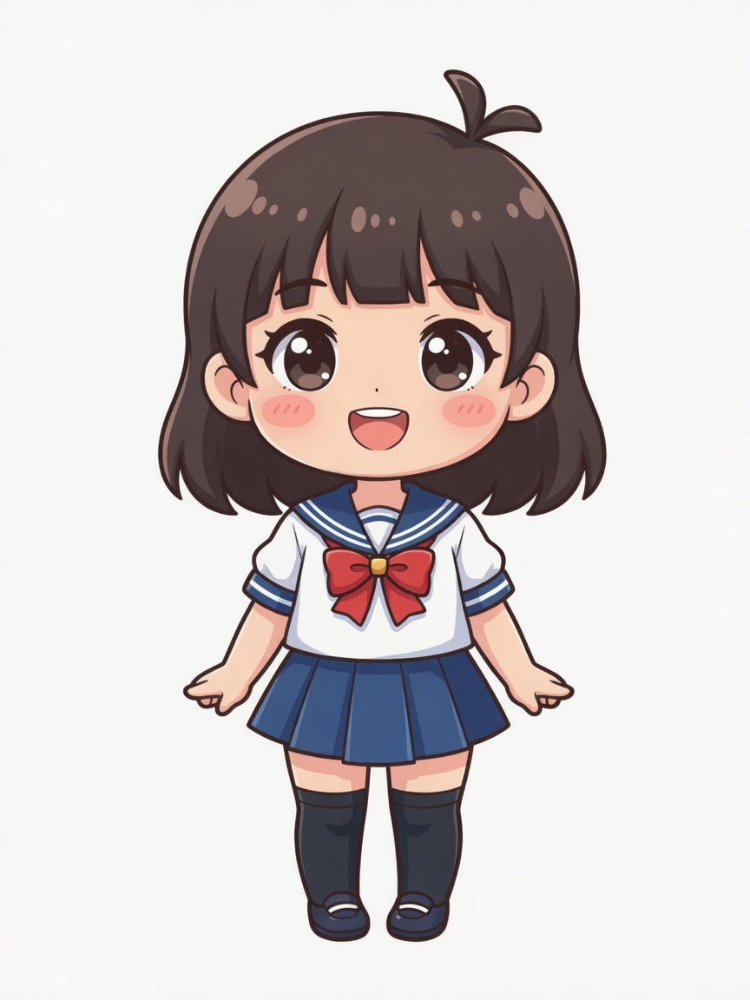

# 🐾 Pets — 元气水手服少女 (Chibi Sailor Girl)

> 原创二次元 Chibi 风格角色立绘素材集 —— 齐肩深棕短发、蓝白水手服、黑色过膝袜、圆脸大眼、元气活泼。
> 提供主参考图、设定变体、9 组状态行、9 组方向行，以及打包好的 Spritesheet 图集，可直接用于游戏 / 桌面宠物 / AI Agent UI。

<p align="center">
  
</p>

---

## 📚 相关教程

- [Grok build 制作热门 Codex 桌宠](https://mp.weixin.qq.com/s/VNZ2Kj59UJ-8fYG819YrQgGrok) —— 本素材集的制作思路来源,介绍如何用 Grok build 生成可用于 Codex 桌宠的角色立绘与 Spritesheet。

## ✨ 特性

- **原创角色**，不参考任何既有动漫 / 游戏角色
- **身份锁定**：发型、脸型、水手服、过膝袜、Q 版比例全程冻结，多帧高度一致
- **完整状态机**：待机 / 移动 / 挥手 / 跳跃 / 失败 / 等待确认 / 运行中 / 检查结果
- **8 + 1 方向眼神**：正面 + 一整圈头部朝向，可直接驱动看镜头 / 看指针交互
- **开箱即用 Spritesheet**：v2 正式图集（8×11 / 192×208），透明背景，色键友好
- **2D Cel-shaded**：干净黑色描边、软分层上色、正面柔光，纯白底可抠

---

## 🎨 角色设定

| 项 | 设定 |
|---|---|
| 气质 | 元气活泼、圆脸大眼 |
| 发型 | 齐肩深棕色，齐刘海，头顶 ahoge（画面偏右） |
| 服装 | 蓝白水手服：白上衣 / 海军蓝领与袖口条纹 / 红领结金扣 / 海军蓝百褶短裙 |
| 袜鞋 | 黑色过膝袜 + 深蓝便鞋 |
| 比例 | Chibi：头约占身高 2/5，短肢圆手 |
| 风格 | 2D cel-shaded，黑色描边，软分层，粉润腮红 |
| 背景 | 主基准纯白；其余默认可抠纯色，无地面影 / 无场景 |

---

## 📁 目录结构

```
assets/
├── MANIFEST.md                       # 资产总清单（权威文档）
└── character/
    └── chibi_sailor/
        ├── MASTER_REF.jpg            # ★ 主对齐基准（纯白底正面全身）
        ├── character.json            # 角色配置 + 图集元数据
        ├── char_front_full.jpg       # 正面全身（灰底初稿）
        ├── char_side_half.jpg        # 侧面半身（严格 profile）
        ├── char_side_full_bonus.jpg  # 侧面全身（睁眼附加参考）
        ├── expr_smile.jpg            # 表情：微笑
        ├── expr_focus.jpg            # 表情：专注
        ├── expr_dejected.jpg         # 表情：沮丧
        ├── pose_wave.jpg             # 挥手姿态全身
        ├── states/                   # 9 组状态行（由 MASTER_REF edit-chain）
        ├── looks/                    # 9 组方向行（只动头颈与眼神）
        └── sheet/                    # Spritesheet 图集（v2 正式版 + 旧草稿）
```

---

## 🖼️ 状态行 `states/`

全部由 `MASTER_REF.jpg` edit-chain 生成，**只改动作 / 表情，不改身份**。

| 文件 | 状态 | 动作要点 |
|---|---|---|
| `state_idle.jpg` | 待机 | 正面站立，闭口轻笑，双臂自然下垂 |
| `state_move_right.jpg` | 向右移动 | 右侧面行走中步态 |
| `state_move_left.jpg` | 向左移动 | 左侧面行走中步态 |
| `state_wave.jpg` | 挥手 | 正面右手高举挥手，开朗笑容 |
| `state_jump.jpg` | 跳跃 | 腾空双腿收起，双臂上扬 |
| `state_fail.jpg` | 失败沮丧 | 正面垂肩，泪珠，瘪嘴 |
| `state_wait_confirm.jpg` | 等待确认 | 双手合十胸前，期待微笑 |
| `state_processing.jpg` | 运行中 | 站立专注打字处理任务（含迷你键盘道具） |
| `state_check_results.jpg` | 检查结果 | 托腮思考 + 托举展示，评估神情 |

## 👀 方向行 `looks/`

只动头颈与眼睛；身体 / 水手服 / 过膝袜姿态冻结。
> `screen-left` / `screen-right` 指**画面左右边缘**，不是角色自身的左右手。

| 文件 | 朝向 | | 文件 | 朝向 |
|---|---|---|---|---|
| `look_front.jpg` | 正面 | | `look_down.jpg` | 向下 |
| `look_up.jpg` | 向上 | | `look_down_screen_left.jpg` | 下 + 画面左 |
| `look_up_screen_right.jpg` | 上 + 画面右 | | `look_screen_left.jpg` | 画面左 |
| `look_screen_right.jpg` | 画面右 | | `look_up_screen_left.jpg` | 上 + 画面左 |
| `look_down_screen_right.jpg` | 下 + 画面右 | | | |

---

## 🧩 Spritesheet v2（正式版）

| 项 | 值 |
|---|---|
| 文件 | `sheet/chibi_sailor_spritesheet_v2.webp`（PNG 中间件：`.png`） |
| 总尺寸 | **1536 × 2288** |
| 单元格 | **192 × 208** |
| 网格 | **8 列 × 11 行** |
| 行 0–8 | 状态（当前为 hold 帧，非完整动画序列） |
| 行 9–10 | 16 方向（由 9 张 look 最近邻填充） |
| 行 0 列 6 | v2 neutral look（正面） |

> ⚠️ `sheet/chibi_sailor_spritesheet.webp` 为旧草稿（9×2），请勿用于正式接入。

---

## 🎮 引擎 / UI 接入建议

- 纯白底可用色键或直接抠图，轮廓已干净
- 全身立绘适合**角色卡 / 对话立绘缩放**
- 表情特写适合**对话框头像 / 状态反馈**
- 状态行可直接映射 agent / 任务 UI：`idle / move / wave / jump / fail / wait / processing / check`
- 方向行可驱动**看镜头 / 看指针**的注视交互
- 挥手姿态适合**问候 / 引导**

---

## 📦 素材统计

- 文件总数：**32**
- 图像格式：JPEG（生成器输出），Spritesheet 为 WebP / PNG
- 主参考画幅：3:4（864 × 1152）

---

## 📜 许可

本角色为原创设定。素材仅供学习与个人项目使用；如需用于商业项目，请自行确认相关生成工具的服务条款。
